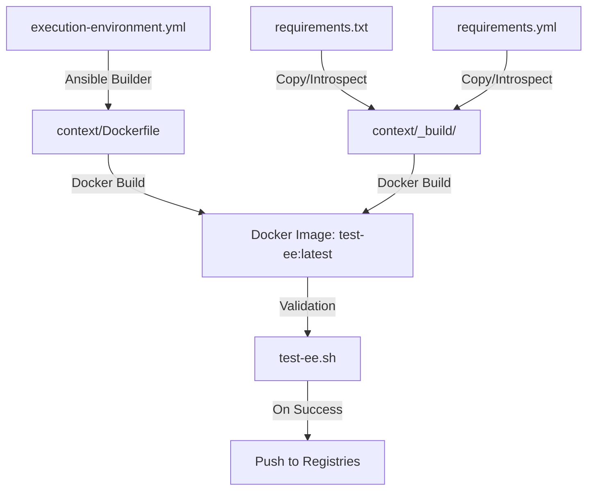

# Repository Onboarding & Architecture Guide for AI Agents

Welcome! This repository defines, builds, and validates a custom **Ansible Execution Environment (EE)** container image. This document provides a deep dive into the repository's structure, workflows, dependencies, and execution flows.

---

## 1. Repository Objective

This project builds a standardized, production-ready container image designed to run Ansible playbooks. By bundling specific system utilities, Python dependencies, and Ansible galaxy roles/collections, it ensures identical playbook execution across various target environments (such as local CLI, AWX, and CI/CD pipelines).

- **Base Image:** `registry.redhat.io/ansible-automation-platform-24/ee-supported-rhel9:latest`
- **Output Image Names:** 
  - Docker Hub: `fbraz3/ansible-executor-environment`
  - Quay.io: `quay.io/fbraz3/local-ee`

---

## 2. Core Dependencies & Packages

The execution environment installs components based on three main configuration files:

1. **Ansible Roles & Collections** ([requirements.yml](file:///Users/felipebraz/PhpstormProjects/pessoal/ansible-executor-environment/requirements.yml)):
   - **Collections:** `ansible.posix`, `ansible.utils`, `community.zabbix`, `community.general`, `community.vmware`, `dseeley.esxifree_guest`, `awx.awx`, `julien_lecomte.proxmox`.
   - **Roles:** `geerlingguy.php`, `geerlingguy.nginx`, `benjamin-smith.ondrej-php-repo`, `lukasic.mariadb`.
2. **Python Packages** ([requirements.txt](file:///Users/felipebraz/PhpstormProjects/pessoal/ansible-executor-environment/requirements.txt)):
   - Dependencies like `pycurl`, `PyVmomi` (VMware integration), `fabric` (SSH/execution), `cryptography`, `awxkit`, `qrcode`, and `Pillow`.
3. **System Packages** (defined in [execution-environment.yml](file:///Users/felipebraz/PhpstormProjects/pessoal/ansible-executor-environment/execution-environment.yml) and [Dockerfile](file:///Users/felipebraz/PhpstormProjects/pessoal/ansible-executor-environment/context/Dockerfile)):
   - Installs `which` and `net-tools` via `microdnf`.

---

## 3. Project Architecture & Connection Flow

The workflow relies on `ansible-builder` to generate build contexts, followed by standard Docker/Container builds:



- **[execution-environment.yml](file:///Users/felipebraz/PhpstormProjects/pessoal/ansible-executor-environment/execution-environment.yml):** The source of truth schema.
- **[context/](file:///Users/felipebraz/PhpstormProjects/pessoal/ansible-executor-environment/context):** Houses the auto-generated [Dockerfile](file:///Users/felipebraz/PhpstormProjects/pessoal/ansible-executor-environment/context/Dockerfile) and `_build/` directory containing copies of the dependency manifests. Modifying the root files requires refreshing the `context/` folder contents.
- **[test-ee.sh](file:///Users/felipebraz/PhpstormProjects/pessoal/ansible-executor-environment/test-ee.sh):** A comprehensive Bash-based testing suite executed inside the container to validate correct environment setup.

---

## 4. CI/CD Workflows

Automated actions are defined under `.github/workflows/`:

### 1. Test Execution Environment ([test-ee.yml](file:///Users/felipebraz/PhpstormProjects/pessoal/ansible-executor-environment/.github/workflows/test-ee.yml))
* **Trigger:** Pushes and Pull Requests targeting `main` or `master`.
* **Flow:**
  1. Check out code.
  2. Setup Docker Buildx.
  3. Login to RedHat Registry (`registry.redhat.io`) using secret tokens to retrieve the base RHEL9 image.
  4. Build a local test image (`test-ee:latest`).
  5. **Verification Steps:**
     - Validate Ansible version command.
     - List installed Ansible collections.
     - Print the first 20 lines of available Ansible plugin docs (`ansible-doc -l`).
     - Run the comprehensive `test-ee.sh` script inside the container.
     - Validate python imports (`ansible`, `jinja2`, `yaml`) and python versions.

### 2. Build Docker Image ([docker-image.yml](file:///Users/felipebraz/PhpstormProjects/pessoal/ansible-executor-environment/.github/workflows/docker-image.yml))
* **Trigger:** Manual trigger (`workflow_dispatch`) or Weekly Schedule (every Wednesday at 10:10 UTC via cron `'10 10 * * 3'`).
* **Flow:**
  1. **Build & Test Stage:** Performs the exact same building and comprehensive testing steps as the test workflow to ensure stability.
  2. **Push Stage:** On success, logs into Docker Hub and Quay.io. Then, builds the image for multi-platform support (`linux/amd64` and `linux/arm64`) using Docker Buildx and pushes the finalized tags to:
     - `fbraz3/ansible-executor-environment:latest` (Docker Hub)
     - `quay.io/fbraz3/local-ee:latest` (Quay.io)

---

## 5. Development & Testing Cheat Sheet

Use these commands to build, test, and run the execution environment locally.

### Local Build & Test Loop
```bash
# 1. Build the local test image
docker build -t test-ee:latest context/

# 2. Run the comprehensive test suite locally
docker run --rm -v $(pwd)/test-ee.sh:/test-ee.sh:ro test-ee:latest bash /test-ee.sh

# 3. Test individual commands or inspect collections
docker run --rm test-ee:latest ansible --version
docker run --rm test-ee:latest ansible-galaxy collection list
```

### Running a Playbook locally using the built EE
```bash
docker run --rm -v $(pwd)/your-playbook.yml:/playbook.yml:ro test-ee:latest ansible-playbook /playbook.yml
```

---

## 6. Required Secrets for CI/CD

To ensure the workflows run successfully, the following repository secrets must be configured:
* `RH_USERNAME` & `RH_TOKEN`: Access to `registry.redhat.io` for downloading the base RHEL9 image.
* `DOCKERHUB_USERNAME` & `DOCKERHUB_TOKEN`: Write credentials for Docker Hub.
* `DOCKER_USERNAME` & `DOCKER_PASS`: Write credentials for Quay.io.

---

## 7. Guidelines for AI Agents Working Here
- **Dependency Updates:** If you add a new python dependency to `requirements.txt` or a collection to `requirements.yml`, ensure you also copy/sync them to `context/_build/` or regenerate the builder context so that Docker builds pick them up.
- **Validating Changes:** Always run `./test-ee.sh` inside a local test container before proposing pull requests or committing code changes.
- **Workflow Modifications:** If tweaking `.github/workflows/docker-image.yml` or `test-ee.yml`, verify that `registry.redhat.io` login steps remain intact as the base image cannot be pulled anonymously.
